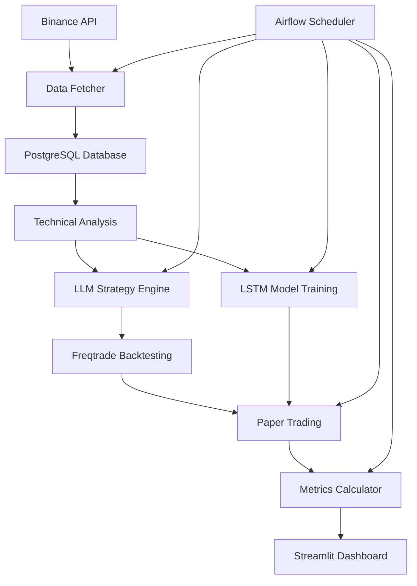

# 🚀 Crypto Trading AI System

A comprehensive hybrid crypto trading system combining LLM strategy generation, LSTM price prediction, and automated backtesting/paper trading across spot, margin, and futures markets.

## ⚠️ RISK WARNING

**This system is for educational and research purposes only. Cryptocurrency trading involves substantial risk of loss. Never trade with money you cannot afford to lose. Past performance does not guarantee future results. Always do your own research and consider consulting with a financial advisor.**

## 🏗️ Architecture Overview



## 🎯 Key Features

### 📊 Data & Analytics
- **Real-time Data**: Binance WebSocket + REST API (15-minute OHLCV)
- **Technical Indicators**: 20+ indicators (EMA, RSI, MACD, Bollinger Bands, etc.)
- **Performance Metrics**: ROI, Sharpe ratio, drawdown, win rate, MAPE

### 🤖 AI-Powered Strategy Generation
- **LLM Strategy Engine**: OpenAI GPT-4 with function calling
- **Dynamic Strategies**: Market-adaptive with max 3 indicators & 3 conditions
- **Risk Management**: Automated stop-loss, take-profit, position sizing

### 🧠 LSTM Price Prediction
- **TensorFlow/Keras**: Multi-layer LSTM with dropout
- **Feature Engineering**: Technical indicators + price action
- **Direction Prediction**: -1/0/+1 classification with confidence scores

### 📈 Trading Modes
- **Spot Trading**: Conservative, no leverage
- **Margin Trading**: 3x leverage with tight risk controls
- **Futures Trading**: 2x leverage with funding rate awareness

### 🔄 Automation Pipeline
- **Airflow DAG**: Every 15 minutes
- **Pipeline**: `fetch_data → prepare_data → generate_strategy → backtest → train_lstm → papertrade → log_metrics → feedback_to_llm`

### 📱 Dashboard
- **Streamlit Interface**: Multi-tab dashboard
- **Real-time Charts**: Price, P&L, equity curves
- **Analytics**: Performance heatmaps, trade history
- **Risk Monitoring**: VaR, drawdown, exposure tracking

## 🚀 Quick Start

### Prerequisites
- Docker & Docker Compose
- OpenAI API key
- Binance API credentials (testnet recommended)

### Installation

1. **Clone and setup**:
```bash
git clone <repository>
cd trade-gpt-2
cp .env.example .env
```

2. **Configure environment**:
```bash
# Edit .env file with your API keys
OPENAI_API_KEY=sk-...
BINANCE_API_KEY=...
BINANCE_API_SECRET=...
```

3. **Launch system**:
```bash
docker compose up -d
```

4. **Access interfaces**:
- **Dashboard**: http://localhost:8501
- **Airflow**: http://localhost:8080 (airflow/airflow)
- **Database**: localhost:5432

## 📁 Project Structure

```
trade-gpt-2/
├── docker-compose.yml          # Multi-container orchestration
├── .env.example               # Environment template
├── core-app/                  # Main Python application
│   ├── Dockerfile
│   ├── requirements.txt
│   └── src/
│       ├── config.py          # Configuration & logging
│       ├── data_fetcher.py    # Binance API integration
│       ├── ta_features.py     # Technical analysis
│       ├── llm_strategy.py    # GPT-4 strategy generation
│       ├── lstm_model.py      # LSTM training & prediction
│       ├── backtest_runner.py # Freqtrade wrapper
│       ├── metrics.py         # Performance calculation
│       ├── db.py              # Database models
│       └── dashboard.py       # Streamlit interface
├── freqtrade/                 # Trading engine
│   ├── Dockerfile
│   └── user_data/
│       ├── configs/           # Spot/margin/futures configs
│       └── strategies/        # AI-generated strategies
├── airflow/                   # Workflow orchestration
│   ├── Dockerfile
│   └── dags/
│       └── trade_pipeline.py  # Main pipeline DAG
└── tests/                     # Unit tests
    └── test_core_modules.py
```

## 🔧 Configuration

### Key Parameters
```python
TIMEFRAME = "15m"              # Candle timeframe
SEQ_LENGTH = 60               # LSTM sequence length
SYMBOLS = ["BTC/USDT", "ETH/USDT", ...]  # Trading pairs
RETRAIN_EVERY = 96            # Model retraining frequency
```

### Trading Modes
- **Spot**: 99% balance utilization, 10% stop-loss
- **Margin**: 33% balance, 3x leverage, 5% stop-loss
- **Futures**: 50% balance, 2x leverage, 8% stop-loss

## 📊 Dashboard Features

### Overview Tab
- Portfolio P&L summary
- Average Sharpe ratio
- LSTM prediction accuracy
- Performance heatmap

### Trading Tabs (Spot/Margin/Futures)
- Real-time price charts with LSTM predictions
- P&L tracking and equity curves
- Current strategy display
- Risk metrics monitoring

### Backtest Analytics
- Historical strategy performance
- Equity curve analysis
- Strategy comparison tools
- Performance heatmaps

## 🧪 Testing

Run the test suite:
```bash
# Install test dependencies
pip install pytest

# Run tests
pytest tests/ -v
```

Tests cover:
- Configuration validation
- Technical analysis indicators
- Metrics calculations
- LSTM model components
- LLM strategy validation

## 🔒 Security Considerations

- **API Keys**: Store securely, use testnet for development
- **Paper Trading**: All trading is simulated by default
- **Database**: Use strong passwords, consider encryption
- **Network**: Implement firewall rules for production

## 📈 Performance Optimization

- **Data Caching**: PostgreSQL with indexed timestamps
- **Async Operations**: WebSocket connections for real-time data
- **Model Optimization**: TensorFlow GPU support (optional)
- **Resource Limits**: Docker memory/CPU constraints

## 🛠️ Development

### Adding New Indicators
1. Implement in `ta_features.py`
2. Update LLM prompt templates
3. Add to strategy validation

### Custom Strategies
1. Modify `llm_strategy.py` prompts
2. Update Jinja2 templates in Freqtrade
3. Test with backtesting

### Extending Trading Modes
1. Add new config in `freqtrade/configs/`
2. Update dashboard tabs
3. Implement mode-specific logic

## 📋 Roadmap

- [ ] Multi-exchange support (Coinbase, Kraken)
- [ ] Advanced portfolio optimization
- [ ] Sentiment analysis integration
- [ ] Mobile app interface
- [ ] Real money trading (with safeguards)

## 🤝 Contributing

1. Fork the repository
2. Create feature branch (`git checkout -b feature/AmazingFeature`)
3. Run tests (`pytest tests/`)
4. Commit changes (`git commit -m 'Add AmazingFeature'`)
5. Push to branch (`git push origin feature/AmazingFeature`)
6. Open Pull Request

## 📄 License

This project is licensed under the MIT License - see the [LICENSE](LICENSE) file for details.

## ⚠️ Disclaimer

This software is provided "as is" without warranty of any kind. The authors are not responsible for any financial losses incurred through the use of this system. Cryptocurrency trading is highly risky and speculative. Only trade with funds you can afford to lose completely.

## 📞 Support

For questions and support:
- Open an issue on GitHub
- Check the [documentation](docs/)
- Review the [FAQ](docs/FAQ.md)

---

**Made with ❤️ for the crypto community**